# Week 4 — End-to-End Lakehouse, Analytics & Enterprise Governance (Production-First)

**Dataset:** NYC Yellow Taxi Trips  
**Platform:** AWS S3, AWS Glue (Spark + Delta), Step Functions, Athena, Redshift, DynamoDB, CloudWatch, Terraform, GitHub Actions  
**Goal:** Build a **fully governed, production-style data platform** with end-to-end orchestration, automated data quality, Master Data Management (MDM), dimensional modeling, certified analytics, monitoring, and CI/CD.

---

## What I Built (Week 4 Summary)

### 1) End-to-End Architecture & Platform Design

- Designed a **governance-first lakehouse architecture** with:
  - S3 data zones: `raw → validated → curated → master → archive`
  - Delta Lake for ACID, versioning, and time travel  
  - Glue for distributed processing  
  - Step Functions as orchestration control plane  
  - Athena & Redshift as governed analytics layers  
  - DynamoDB for audit & governance  
  - CloudWatch for monitoring  

**Outcome:**  
A production-style architecture where **data flows through governed zones with quality gates, MDM controls, and certified analytics access**.

**Architecture Diagram**

- Architecture overview: 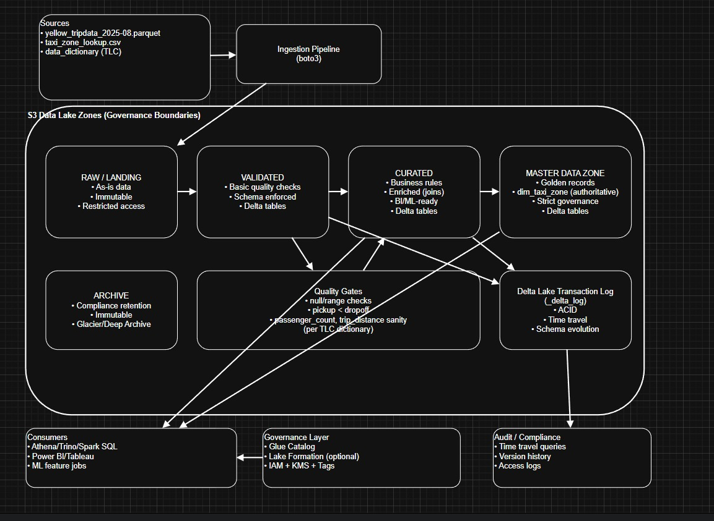  

---

## Orchestration — Step Functions (Core Control Plane)

### What Was Implemented

- Built a **single Step Functions state machine** orchestrating the full pipeline:

1. InitRunContext  
2. Day6 — Raw → Validated  
3. Day7 — Validated → Curated  
4. Day8 — Data Quality Gates  
5. DQGateDecision (pass / fail branch)  
6. Day9 — MDM Zones  
7. StewardQueueDecision  
8. Day10 — Lifecycle & Orphans  
9. Export Delta → Parquet  
10. Athena — Create External Tables & Views  
11. Redshift — COPY Load  
12. Success / FailPipeline  

- Added:
  - Retry & catch on every step  
  - Fail-fast governance on DQ or MDM failure  
  - Centralized failure state  

**Outcome:**  
The entire platform runs as **one deterministic, governed workflow**.

### Orchestration Evidence

- Step Functions graph: 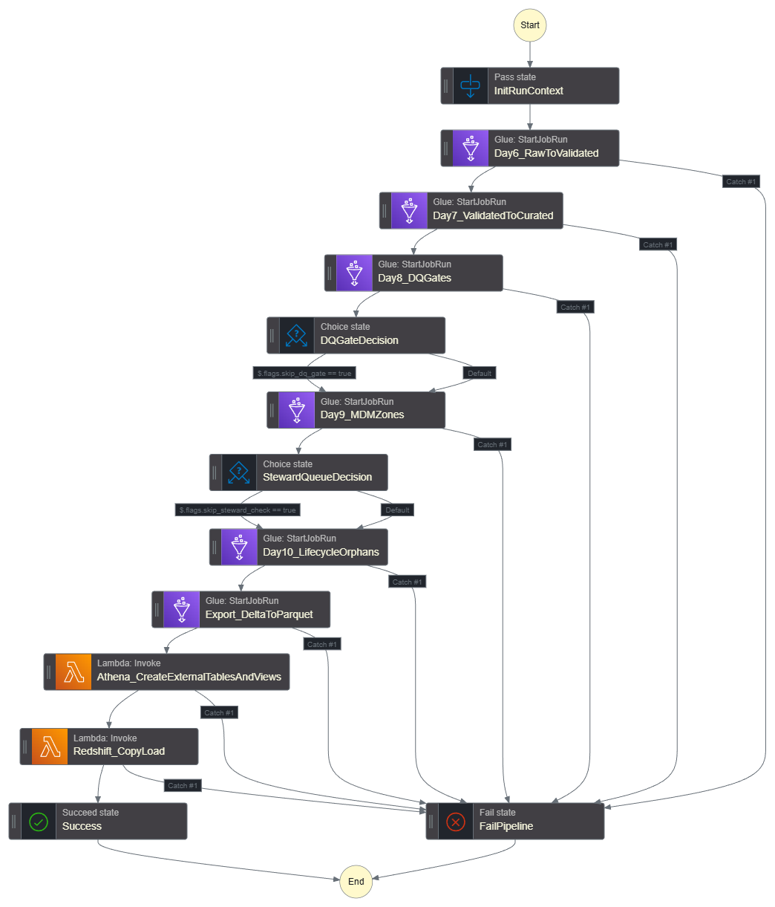  

---

## Triggers — EventBridge & Scheduling

- Configured EventBridge rules to trigger the pipeline:
  - Scheduled execution  
  - Optional S3 event-based trigger  

**Evidence**

- Schedule / S3 trigger rule: 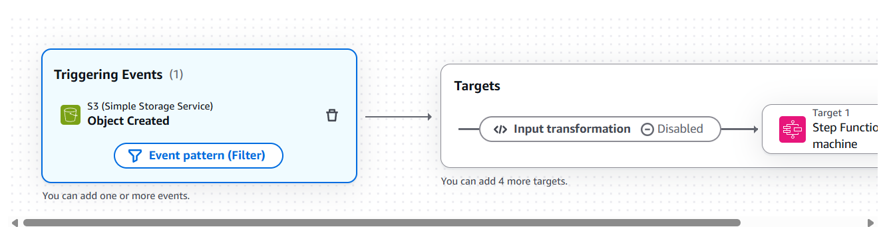  

---

## Processing Layer — Glue ETL Jobs

### Glue / Spark Jobs Used as Pipeline Steps

- **Day 6 — Raw → Validated (Delta)**
  - Schema enforcement  
  - Type casting  
  - Delta Lake write  

- **Day 7 — Validated → Curated (Enrichment)**
  - Join with taxi zone lookup  
  - Derived metrics (trip duration, sanity checks)  

- **Day 8 — Data Quality Gates**
  - Not-null checks  
  - Range checks  
  - Referential integrity  
  - Quarantine failed records  

- **Day 9 — MDM Matching & Deduplication**
  - Standardization  
  - Blocking  
  - Similarity scoring  
  - Golden record creation  

- **Day 10 — Lifecycle & Orphan Detection**
  - Delta history inspection  
  - Orphan transaction detection  
  - Audit snapshot  

- **Export Layer**
  - Delta → Parquet export for analytics  

### Processing Evidence

- Glue job runs: 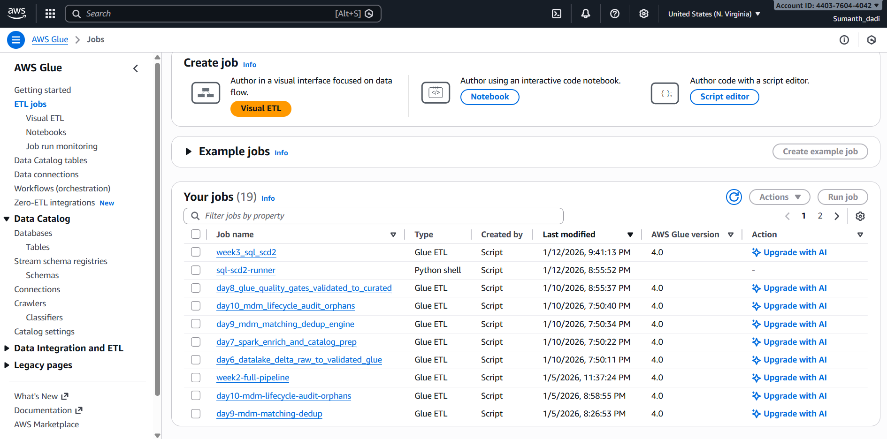  

---

## Outputs — S3 Data Zones

After each run, outputs are written to governed S3 zones.

- Curated output: 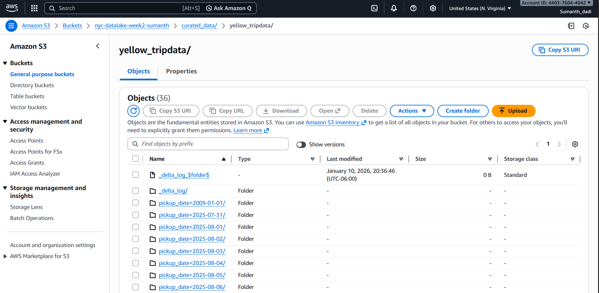  
- Orphans quarantine: 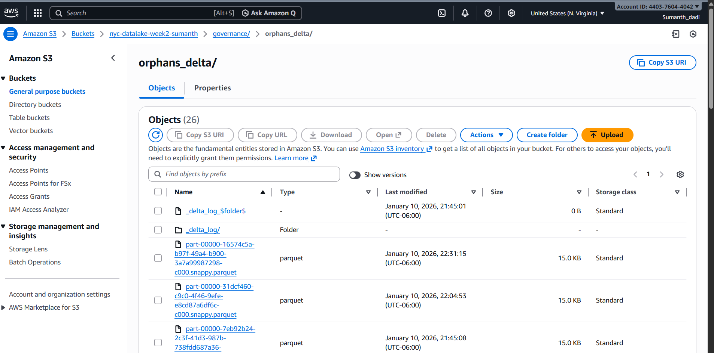  
- Audit outputs: 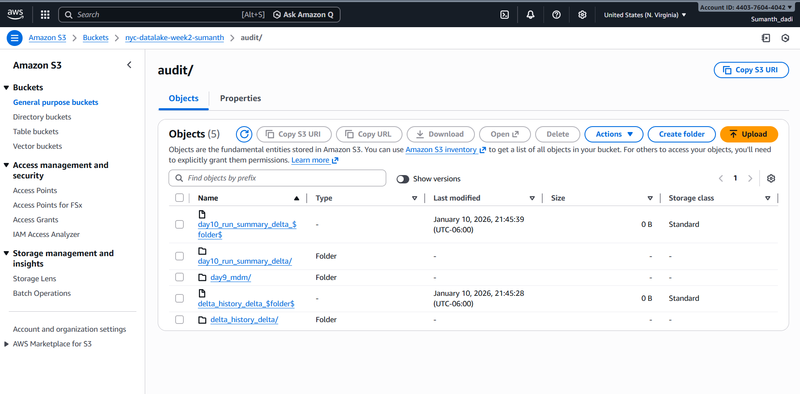  

---

## Data Quality & Governance Gates

### What Was Implemented

- Rule-based quality checks:
  - Not-null validations  
  - Pickup < Dropoff  
  - Passenger count sanity  
  - Trip distance sanity  
  - Referential integrity to master zones  

- Automated enforcement:
  - Passed records → curated  
  - Failed records → quarantine  
  - DQ summary generated per run  

**Outcome**

- No bad data reaches:
  - MDM  
  - Redshift  
  - Athena  
  - QuickSight  

### Data Quality Evidence

- Data quality SQL results:   
- Data quality summary: 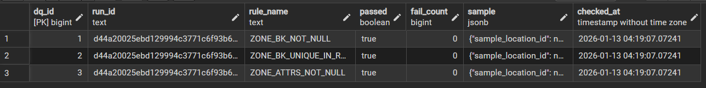  

---

## Master Data Management (MDM)

### What Was Implemented

- Matching & deduplication engine:
  - Standardization  
  - Blocking  
  - Similarity scoring  
  - Survivorship rules  

- Golden record creation in **master zone**  
- Stewardship & governance tables  
- Lifecycle tracking  

**Outcome**

- A governed **master data zone** with:
  - Single source of truth  
  - Steward-controlled updates  
  - Full audit trail  

### MDM Evidence

- Governance table: 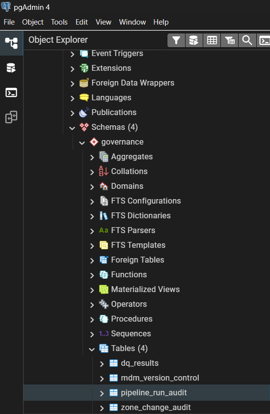  

---

## Slowly Changing Dimensions (SCD Type 2)

### What Was Implemented

- Implemented SCD Type 2 using Delta:

  - Surrogate key  
  - `effective_from`, `effective_to`  
  - `is_current`  
  - Version number  

- Hash-based change detection  
- Audit logging for:
  - Insert  
  - Expire  
  - No-change  
- Rollback capability  

**Outcome**

- Historical truth preserved for:
  - Analytics  
  - Audits  
  - Compliance  
  - Dispute resolution  

### SCD Type 2 Evidence

- SCD2 table schema: 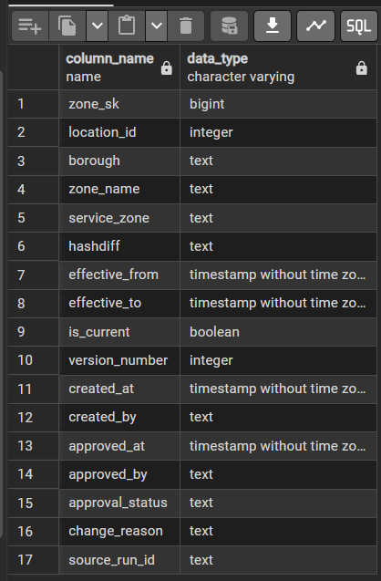  
- SCD2 history example: 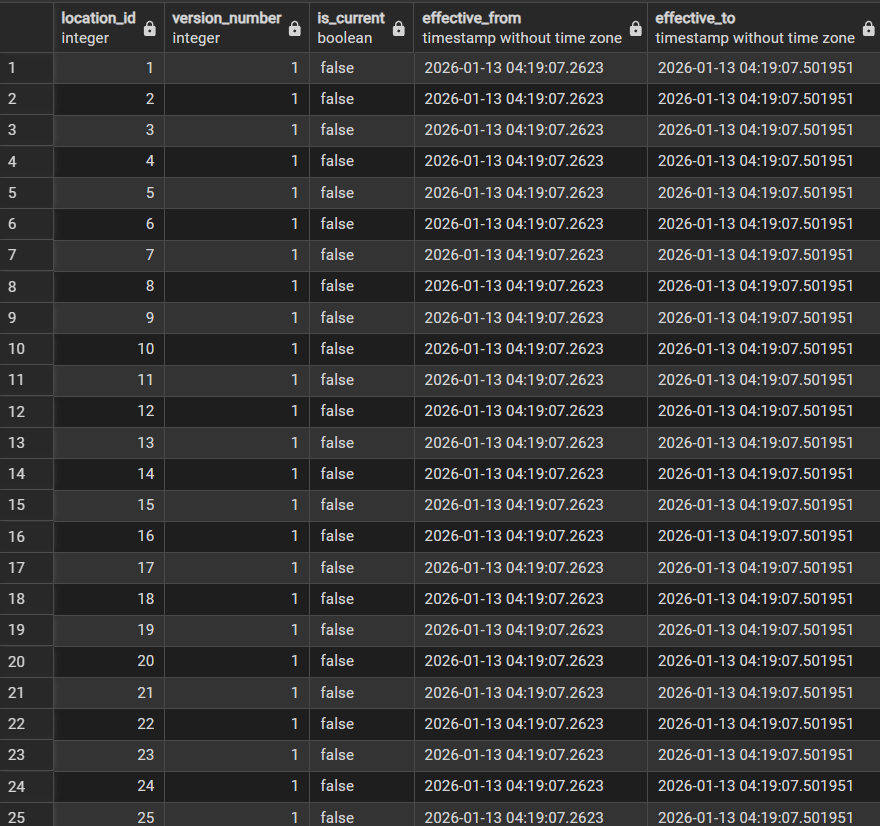  
- Rollback / version history: 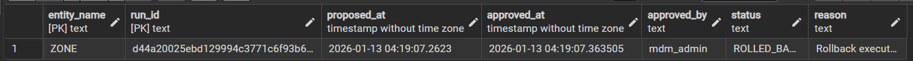  

---

## Analytics Layer — Athena, Redshift & QuickSight

### Athena — Certified Views

- Created certified databases & views  
- Enforced governed, read-only access  
- Serverless analytics entry point  

**Evidence**

- Athena result 1:   
- Athena result 2:   
- Athena workgroup:   

---

### Redshift — Dimensional Model

- Implemented star schema:
  - `dim_zone`  
  - `fact_trip`  

- Optimized joins for analytics  

**Evidence**

- Redshift schema: 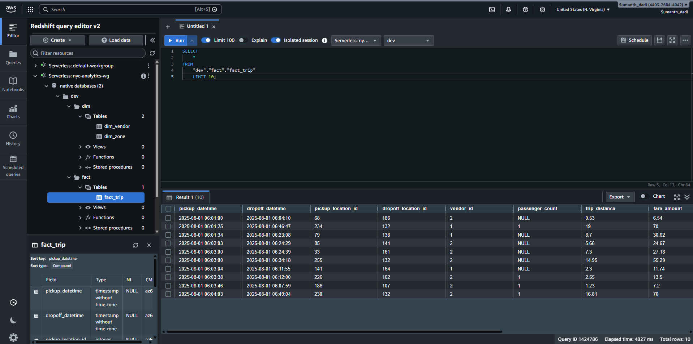  
- Redshift namespace: 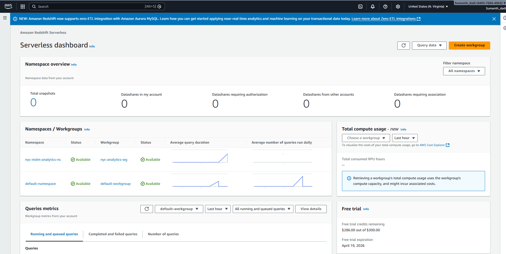  
- Redshift workgroup: 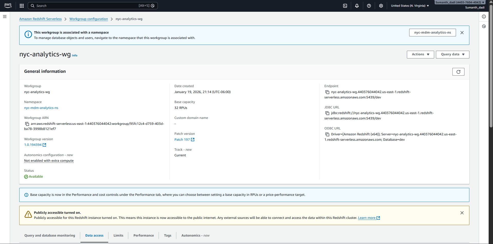  

---

### QuickSight — Business Dashboard

- Built analytics dashboard on certified layer  

**Evidence**

- QuickSight dashboard: 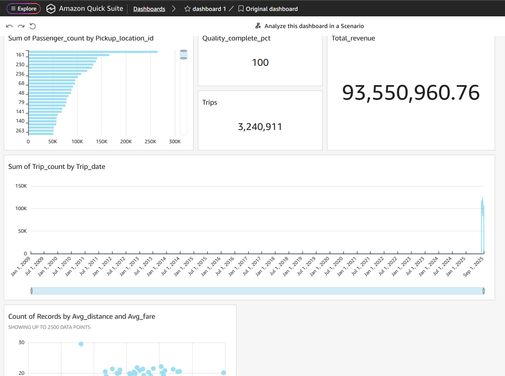  

---

## Auditability & Monitoring

### What Was Implemented

- Central audit logging in DynamoDB:
  - Pipeline run audit  
  - DQ results  
  - MDM lifecycle  
  - Version control  

- Operational monitoring:
  - Glue job metrics  
  - Step Functions history  
  - CloudWatch alarms  

**Outcome**

- Every run is:
  - Traceable  
  - Auditable  
  - Reproducible  

### Audit & Monitoring Evidence

- Audit table: 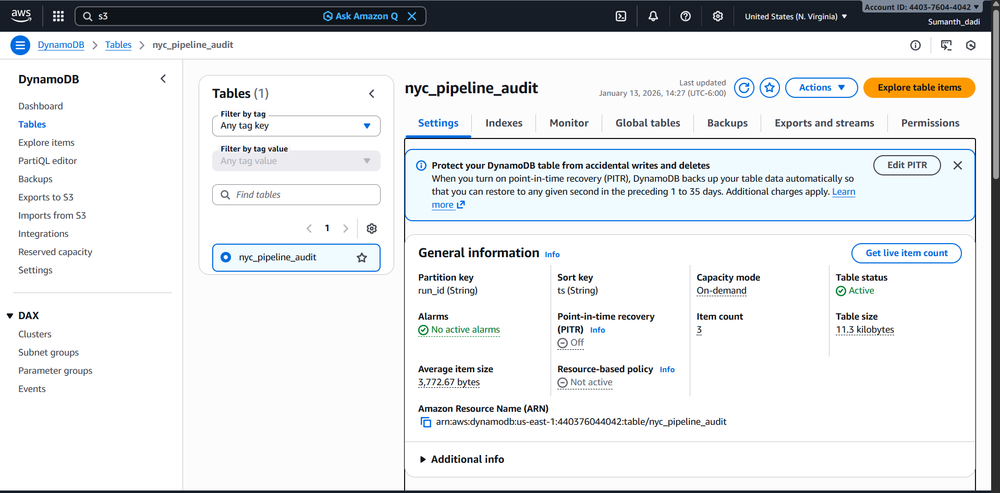  
- Audit table view: 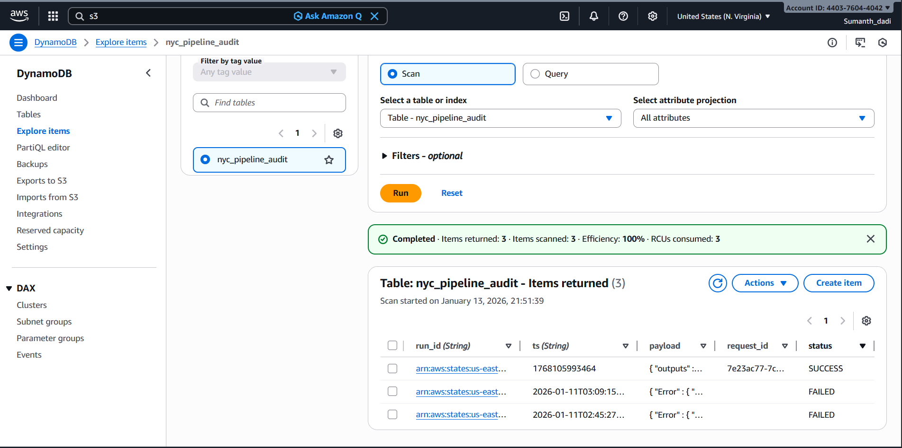  
- CloudWatch dashboard: 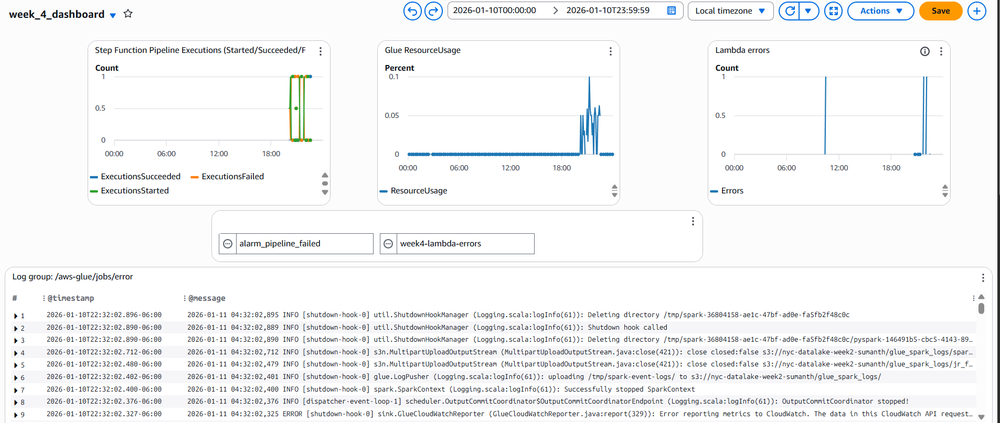  

---

## Final Demo Execution Flow

1. Ingest source data into `raw/`  
2. Trigger Step Functions pipeline  
3. Execute all Glue + Lambda steps  
4. Validate outputs in:
   - S3 zones  
   - DQ reports  
   - MDM tables  
   - Athena certified views  
   - Redshift star schema  
   - Audit tables  
   - CloudWatch metrics  

---

---

## Key Learnings (Week 4)

- Governance must be **designed into the architecture**, not added later  
- Step Functions is the backbone of enterprise orchestration  
- Data quality gates must precede MDM and analytics  
- SCD Type 2 is mandatory for enterprise historical truth  
- Certified analytics layers prevent uncontrolled data access  
- Audit & lineage are first-class citizens in production systems  
- Automation is required for reproducibility and compliance  

---

**End of Week 4 — Final Live Demo Documentation**

